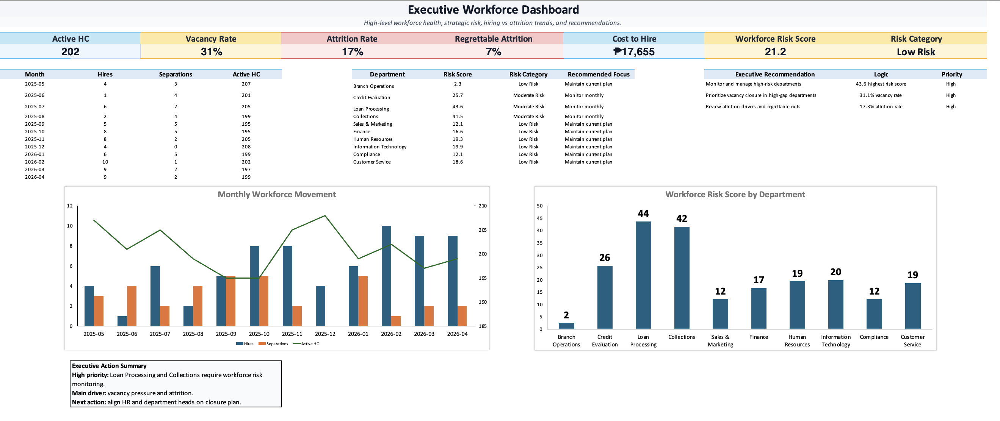
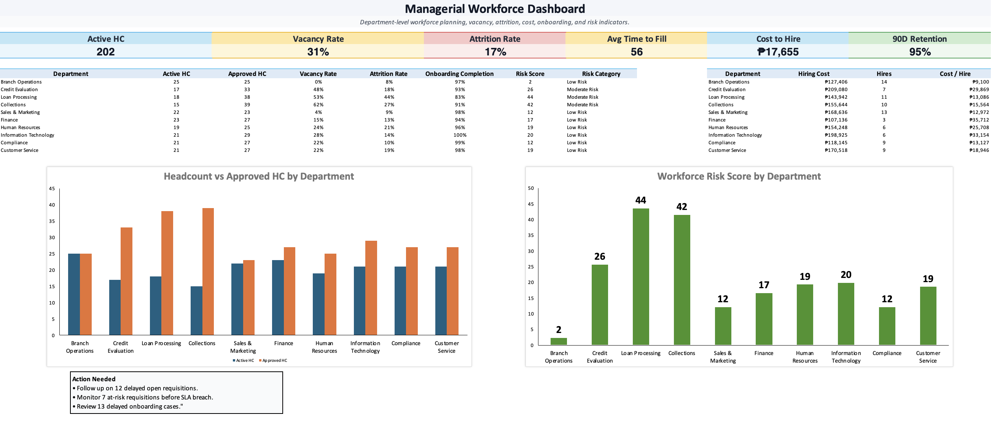

# HR Workforce Intelligence System

An Excel-based HR workforce analytics tracker built with synthetic data to demonstrate business analysis, workforce analytics, KPI design, dashboarding, data quality controls, and SQL/Power BI-ready structure.

## Project Overview

This portfolio project simulates a mid-sized financing company that needs a centralized HR workforce intelligence system. The system tracks recruitment, attrition, onboarding, workforce capacity, hiring cost, productivity, and workforce risk.

The goal is to turn scattered HR operations data into an audit-ready workbook that supports HR action, managerial planning, and executive workforce decisions.

## Key Features

- Excel-based analytics tracker
- Structured source tables and lookup controls
- Formula-driven KPI calculations
- Executive and managerial dashboard views
- Synthetic HR workforce dataset
- Data quality and governance-oriented structure
- SQL-ready schema design
- Power BI-ready model planning

## Core Metrics

- Active Headcount
- Vacancy Rate
- Attrition Rate
- Average Time to Fill
- Cost to Hire
- 90-Day Retention
- Requisition Aging
- Workforce Risk Score
- Onboarding Progress
- Productivity Indicators

## Tools Used

- Microsoft Excel
- Excel formulas
- Dashboard design
- Data validation
- KPI modeling
- Synthetic data modeling
- SQL-ready table structure
- Power BI model planning

## Files

| File | Description |
|---|---|
| `DenzelLim_HR_Workforce_Intelligence_System.xlsx` | Main Excel workbook |
| `DenzelLim_HR_Workforce_Intelligence_CaseStudy.pdf` | One-page portfolio case study |
| `screenshots/` | Dashboard screenshots |
| `docs/` | Supporting documentation |

## Screenshots

### Executive Dashboard

### Managerial Dashboard

## Business Value

This system helps surface workforce risk, hiring bottlenecks, vacancy pressure, onboarding gaps, cost efficiency, productivity pressure, and priority departments for action.

## My Role

Designed the workbook architecture, synthetic data model, KPI logic, formulas, dashboards, QA checks, SQL-ready schema, Power BI model guide, and portfolio documentation.

## Data Disclaimer

This project uses synthetic data only. No real employee, company, or confidential information is included.
